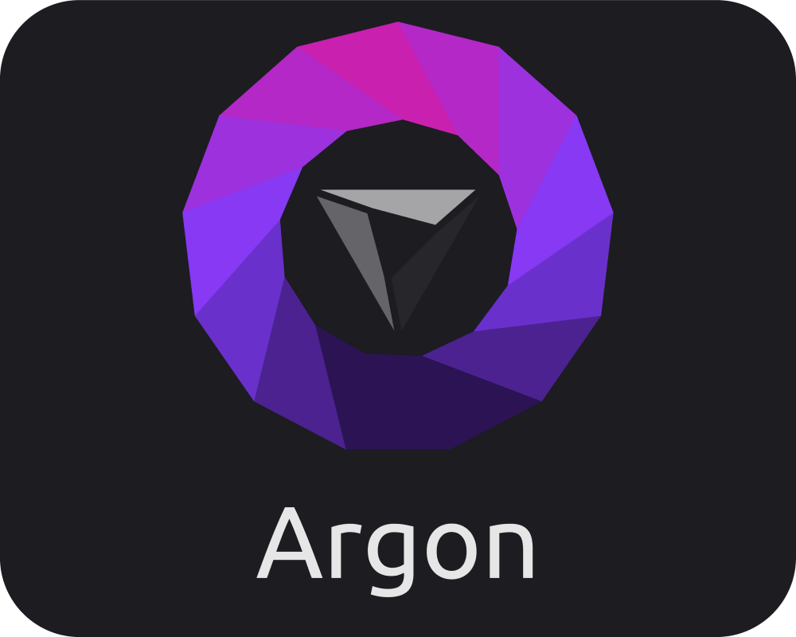
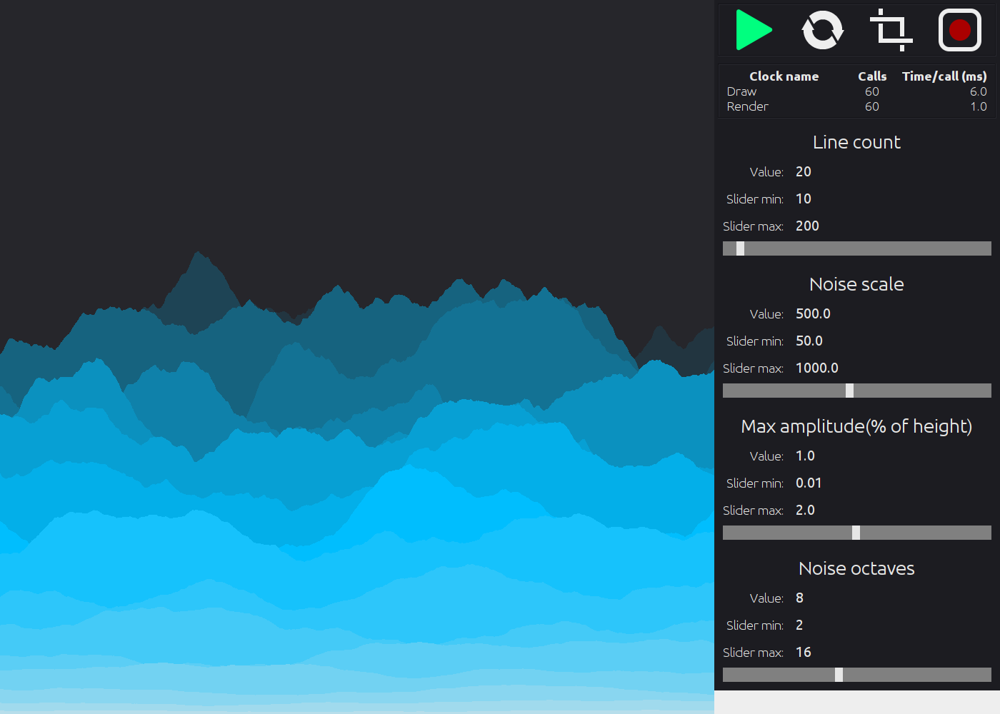
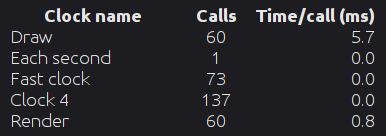
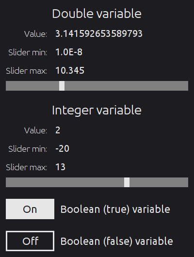

### Table of contents
- [Description](#description)
- [UI](#ui)
  - [Buttons](#buttons)
  - [Clocks and stats](#clocks-and-stats)
  - [Variables](#variables)
- [Clocks](#clocks)
- [Where to start](#how-do-i-start-using-it)

## Description
### So what is it?
Argon is a powerful Java framework made for code visualization and generative art. It provides intuitive and minimalistic UI, flexible loop management, dynamic interactivity with the code and much more.

### Why would I use it?
If you ever used JavaFX, Swing or AWT you definitely know how much code overhead there is and how tedious it is to write simple windowed app.  
Argon was built to eliminate all of this.
```
Argon argon = new Argon(1000, 1000);
Layer layer = argon.createLayer();

// Your code goes here

argon.show(); 
```
This is it! The code above creates a window, canvas and wraps them in a slick UI.

## UI
  
*"Mountains" example project running on Argon*

### Buttons


### Clocks and stats

<br>
This part of the UI shows user-created clocks. The panel shows the number of calls per clock and how long each call took.  
The last line is always a clocks called "Render". It is created internally and is responsible for rendering an image and displaying it onto the viewport.

### Variables

<br>
Right now there are 3 supported variables: double, integer and boolean (flag). Variables are displayed in the same order as they were added with ` argon.addVariables(...variables) `.

## Clocks
Buttons, variables - that's simple, but exactly is a clock in Argon?
### What are clocks?
Clocks are use-created and Argon-managed loop functions. Each can run at different updaterates (frequencies) from others and Argon keeps track of clocks' relative pace, which ensures parallel-like calls, but in a single thread.  
Clock manager prioritizes completing function calls over realtime rendering. Thus, frequencies can be thought of as target updaterates and become relative if a function takes long time to execute.

### Example
Let's say you want two functions: one to draw something at 60 UPS (updates per second) and another to update something at 90 UPS:
```
argon.addClock("Draw", () -> {
    // Draw smt
}, 60);
argon.addClock("Update", () -> {
    // Update smt
}, 90);
```
Argon ensures that each second first clock will run exactly 60 times and second - 90. The behavior in-between is similar to that of running functions in separate threads (in perfect parallel), except it is executed in one.

### What if a function is slow?
If either of the functions slow down below their maximum time threshold, Argon will reduce every clock proportionally. From the example, the first clock's maximum execution time is 16.7ms and second's - 11.1ms. The first clock's real execution time is 25ms (40 UPS) - a reduction of 33.3%. Therefore, every other clock's frequency is also reduced by 33.3%. In that case what you will see in the UI clocks panel is:  
Draw > 40 calls  
Update > 60 calls

## How do I start using it?
First, initiate Argon:
```
Argon argon = new Argon(1920, 1080);
```

There is no one canvas to draw on, but rather drawing is done in layers. Once created, they all have the same dimensions as when creating an Argon instance. Layers are transparent by default and are based on BufferedImage with exposed pixel raster. For more complex shapes Graphics2D can be used.
> Layer are stored sequentially, meaning the first created layer will be the top layer.
```
Layer layer = argon.createLayer();
```

To finalize and show the window use `show` method.
> `show` or `showAndStart` must be on the last line in your program. Any changes to Argon instance after it is shown might not work properly.
```
argon.show();
```

For a more detailed explanation and examples, see the `examples` folder.
